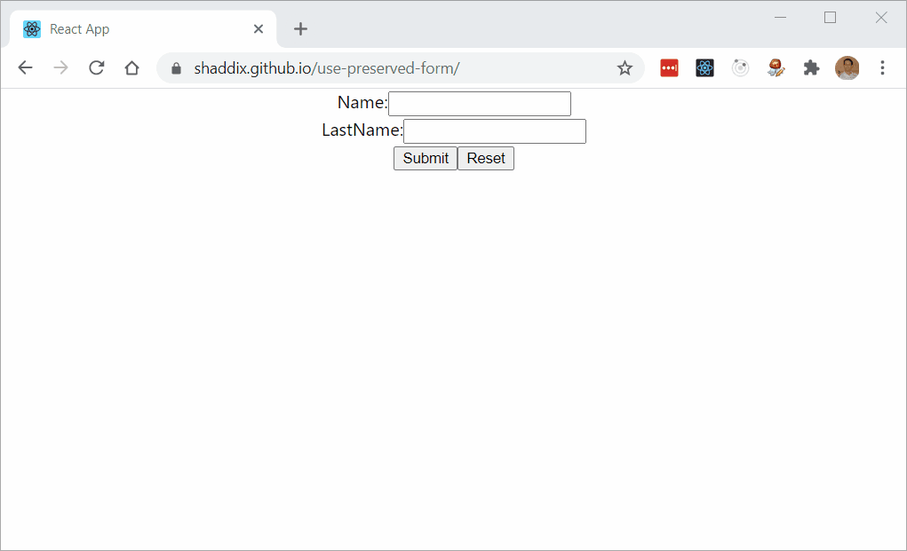

# react-hook-form-preserved

This is an extension to [react-hook-form](https://github.com/react-hook-form/react-hook-form) that preserves user input in case page was refreshed or form was closed.

Here's the [demo](https://shaddix.github.io/use-preserved-form/).



## Install

    npm install react-hook-form-preserved


## How-to use

Just use `usePreservedForm<FormData>('mainForm', options)` instead of `useForm<FormData>(options)`. Form imput will be automatically preserved in local-storage and restored after page is refreshed/reopened (technically, on `componentDidMount`).
Parameters:
- `formName` - unique name under which form values will be saved in local-storage
- `options` - usual options of react-hook-form.

There's also a small [example](https://github.com/Shaddix/use-preserved-form/blob/master/example/src/Form.tsx) available.

## Quickstart

```jsx
import React from 'react';
import { usePreservedForm } from 'react-hook-form-preserved';

function App() {
  const { register, handleSubmit, errors, reset } = usePreservedForm('myForm'); // initialise the hook
  const onSubmit = (data) => {
    console.log(data);
    reset(); // most probably you want to reset the form to set empty all inputs
  };

  return (
    <form onSubmit={handleSubmit(onSubmit)}>
      <input name="firstname" ref={register} />
      
      <input name="lastname" ref={register({ required: true })} />
      
      <input type="submit" />
    </form>
  );
}
```
